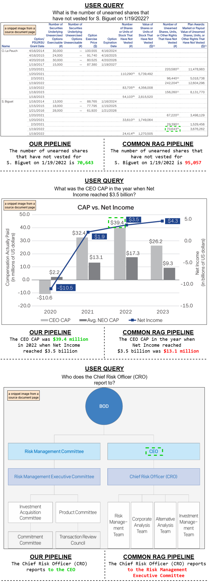
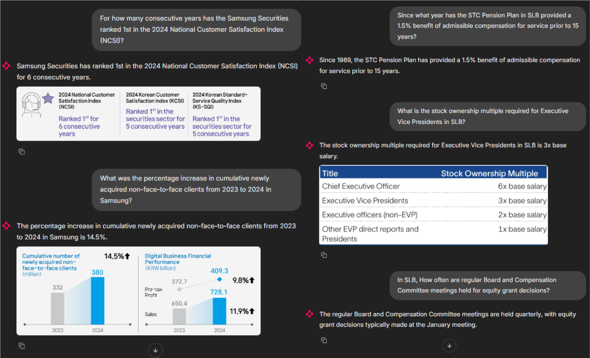

# VisText-RAG-DocumentQNA

This repository provides a complete implementation of a **multimodal RAG system** designed for document question answering. It includes an **indexing pipeline** that processes your document corpora by extracting both text and visual elements (such as tables and figures) and storing them in a vector database using **sentence embeddings** and **ColPALI image embeddings**. It also features a **chat inference pipeline** that handles user queries, performs dual retrieval over text and image embeddings, and generates context-aware answers using a vision-capable language model. This setup enables accurate and explainable retrieval from visually rich documents.

📝 You can read the full article here:  
👉 [ColPALI Meets DocLayNet: A Vision-Aware Multimodal RAG for Document-QA](https://medium.com/@hanifsarubany10/towards-a-zero-shot-pipeline-for-ai-based-image-editing-application-4c509bc82ff1)


## 🖼️ Visual Examples

### 🔍 Evaluation: Comparison with Common RAG Pipeline
<p align="center">
  
</p>

> Our pipeline demonstrates superior retrieval accuracy and multimodal understanding compared to common RAG pipelines, especially in handling visually complex document content.

---

### 🎨 Chainlit App – Frontend Overview
<p align="center">
  
</p>

---

## ⚙️ Reproducing the Environment

```bash
# Create Conda Environment
conda create -n multimodal_rag python=3.11
conda activate multimodal_rag

# Install Libraries
pip install -r requirements.txt
```

---
## 🚀 Running the Application

Once you've set up the environment and downloaded the required models, you can launch both the backend and frontend with the following commands:

#### ✅ Run the Backend Server (FastAPI)
```bash
uvicorn main:app --port 8000 
```
#### ✅ Run the Frontend (Streamlit)
```bash
streamlit run frontend.py --port 8001
```

---
## 📚 Adding Knowledge Base
You can enhance the chatbot's responses by providing your own knowledge base (PDF documents).
Before indexing any documents, **ensure that the backend server is running**.                     
1. Put your PDF files into the following directory
```bash
document_sources/
```
2. Then, run the following command to index new documents:
```bash
python execute_indexing.py
```
3. If you want to refresh the entire indexing pipeline (i.e., delete old vectors and start fresh from `document_sources/`), run:
```bash
python execute_indexing.py --initialize
```

---
## 📚 Citation
If you use this work, please consider citing the following foundational papers:
```bibtex
@misc{faysse2024colpaliefficientdocumentretrieval,
  title={ColPali: Efficient Document Retrieval with Vision Language Models}, 
  author={Manuel Faysse and Hugues Sibille and Tony Wu and Bilel Omrani and Gautier Viaud and Céline Hudelot and Pierre Colombo},
  year={2024},
  eprint={2407.01449},
  archivePrefix={arXiv},
  primaryClass={cs.IR},
  url={https://arxiv.org/abs/2407.01449}, 
}
@inproceedings{pfitzmann2022doclaynet,
  title={Doclaynet: A large human-annotated dataset for document-layout segmentation},
  author={Pfitzmann, Birgit and Auer, Christoph and Dolfi, Michele and Nassar, Ahmed S and Staar, Peter},
  booktitle={Proceedings of the 28th ACM SIGKDD conference on knowledge discovery and data mining},
  pages={3743--3751},
  year={2022}
}
@inproceedings{reimers-2020-multilingual-sentence-bert,
    title = "Making Monolingual Sentence Embeddings Multilingual using Knowledge Distillation",
    author = "Reimers, Nils and Gurevych, Iryna",
    booktitle = "Proceedings of the 2020 Conference on Empirical Methods in Natural Language Processing",
    month = "11",
    year = "2020",
    publisher = "Association for Computational Linguistics",
    url = "https://arxiv.org/abs/2004.09813",
}
```

